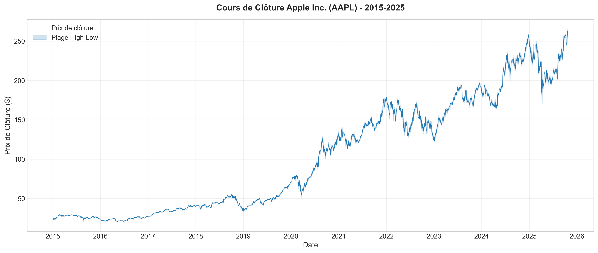
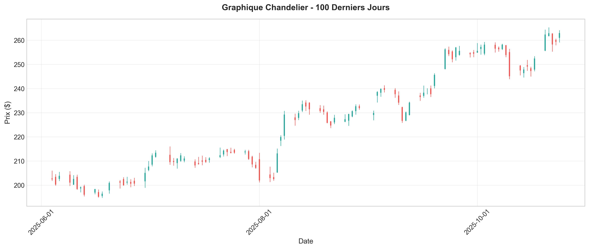
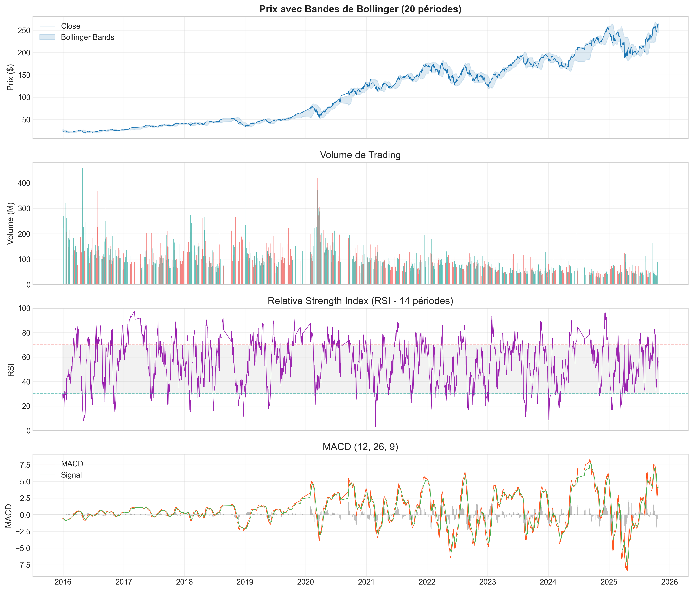
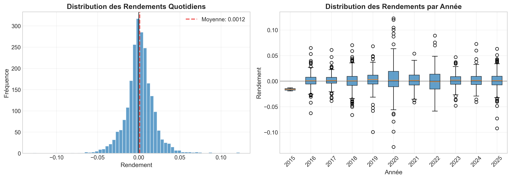
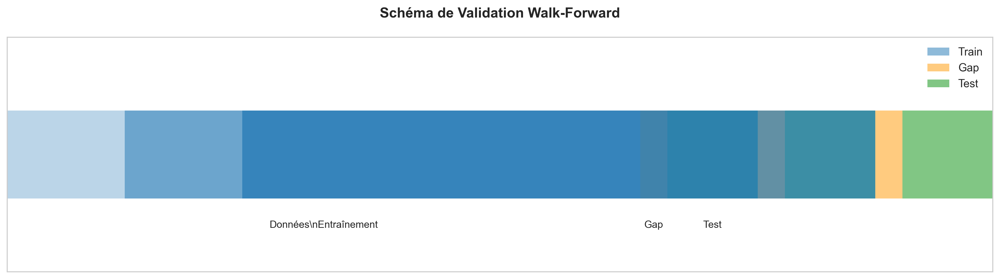
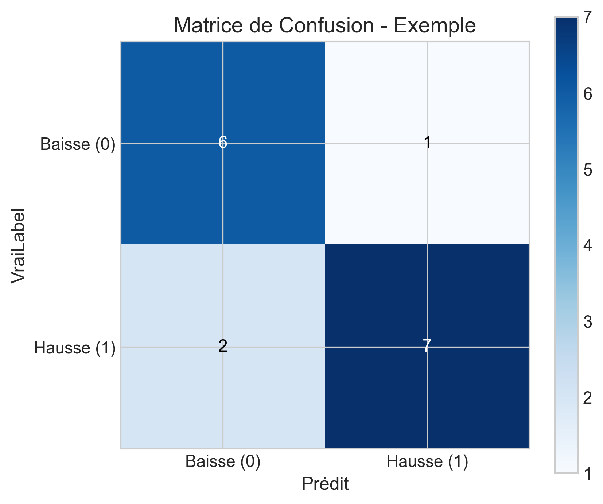
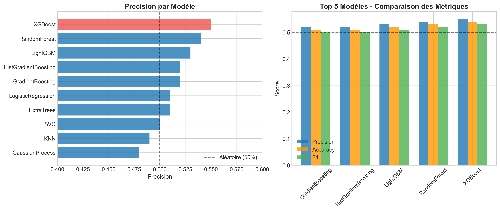
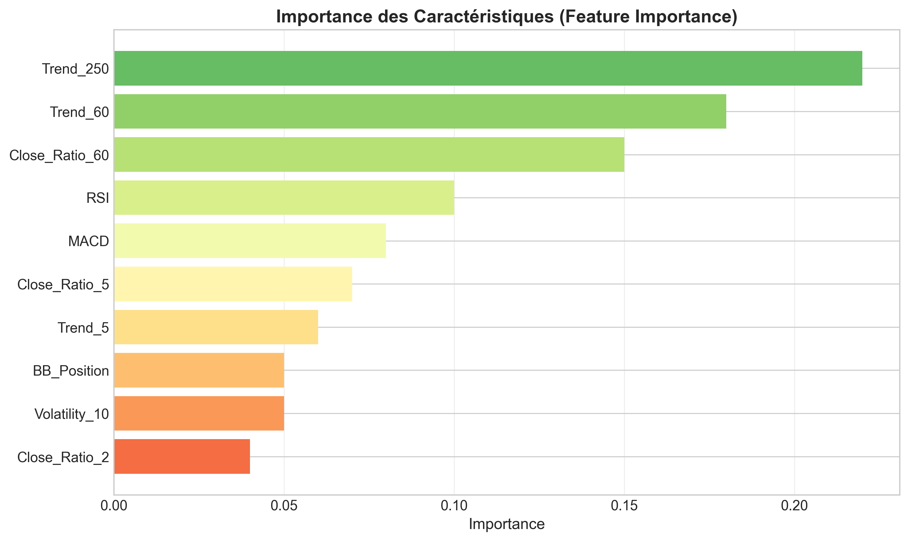
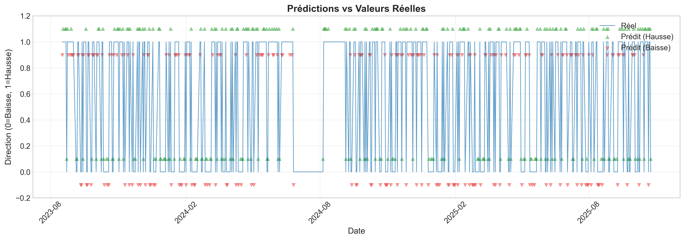
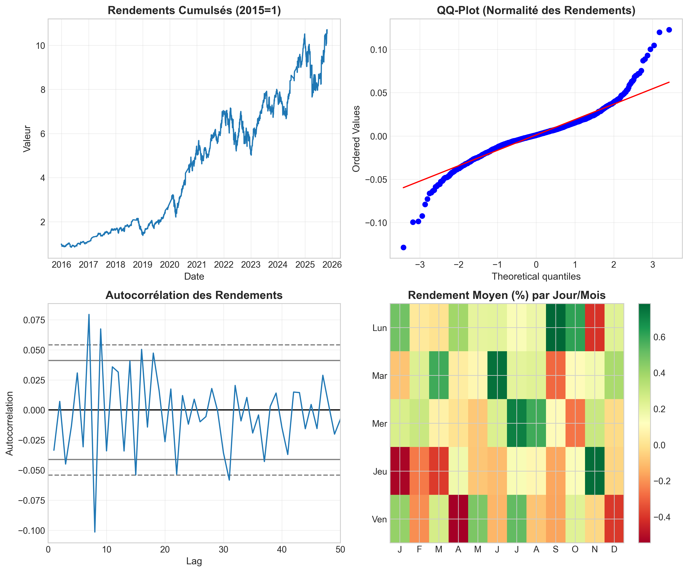

# Stock Price Direction Prediction

A full-stack machine learning web application for predicting stock price movements (up or down). Built with Python for the backend ML pipeline and Next.js for an interactive frontend.


---

## Table of Contents

1. [Overview](#overview)
2. [Features](#features)
3. [Tech Stack](#tech-stack)
4. [Project Structure](#project-structure)
5. [Prerequisites](#prerequisites)
6. [Installation](#installation)
7. [How to Use the Web Application](#how-to-use-the-web-application)
8. [Configuration Parameters](#configuration-parameters)
9. [Pipeline Workflow](#pipeline-workflow)
10. [Technical Indicators](#technical-indicators)
11. [Available Models](#available-models)
12. [Running the Pipeline Programmatically](#running-the-pipeline-programmatically)
13. [API Endpoints](#api-endpoints)
14. [Project File Descriptions](#project-file-descriptions)
15. [Data Files](#data-files)
16. [Annex: Visualizations](#annex-visualizations)
    - [A.1 Price History Chart](#a1-price-history-chart)
    - [A.2 Candlestick Chart](#a2-candlestick-chart)
    - [A.3 Technical Indicators](#a3-technical-indicators)
    - [A.4 Returns Distribution](#a4-returns-distribution)
    - [A.5 Walk-Forward Validation](#a5-walk-forward-validation)
    - [A.6 Confusion Matrix](#a6-confusion-matrix)
    - [A.7 Model Comparison](#a7-model-comparison)
    - [A.8 Feature Importance](#a8-feature-importance)
    - [A.9 Predictions Chart](#a9-predictions-chart)
    - [A.10 Statistics Summary](#a10-statistics-summary)
17. [License](#license)

---

## Overview

This application predicts whether a stock price will go **up** or **down** over a specified prediction horizon (default: 30 days). It uses a comprehensive machine learning pipeline that:

- Downloads historical stock data from Yahoo Finance
- Preprocesses and cleans the data
- Generates technical indicator features
- Trains and evaluates multiple ML models using walk-forward validation
- Selects the best model based on precision score
- Generates future predictions with confidence bands

The web interface allows users to select from 16 major stocks, configure parameters, run predictions, and visualize results with interactive Plotly charts.

---

## Features

- **16 Major Stocks**: AAPL, MSFT, AMZN, GOOGL, META, NFLX, NVDA, AMD, TSLA, JPM, GS, WMT, KO, NKE, XOM, BA
- **11 Machine Learning Models**: Random Forest, Gradient Boosting, Extra Trees, Histogram Gradient Boosting, Logistic Regression, Ridge, KNN, SVC, XGBoost, LightGBM, CatBoost
- **Automatic Model Selection**: Pipeline evaluates all models and selects the best performer by precision score
- **Walk-Forward Validation**: Time-series cross-validation to prevent look-ahead bias
- **Interactive Visualizations**: Plotly-based charts with prediction confidence bands
- **Model Comparison**: Bar charts comparing all model performance metrics
- **Configurable Parameters**: Adjust prediction horizon, training ratio, and decision threshold

---

## Tech Stack

### Backend
- **Python 3.12+**: Core programming language
- **pandas/numpy**: Data processing
- **yfinance**: Stock data acquisition
- **scikit-learn**: Machine learning models
- **XGBoost/LightGBM/CatBoost**: Advanced gradient boosting models

### Frontend
- **Next.js 14+**: React framework with App Router
- **TypeScript**: Type-safe JavaScript
- **Tailwind CSS**: Utility-first styling
- **Framer Motion**: Smooth animations
- **Plotly.js**: Interactive charts

---

## Project Structure

```
stock-prices/
├── pipeline.py              # Main prediction pipeline orchestrator
├── visualization.py        # Plotly chart utilities
├── run_all_models.py      # Model comparison runner
├── generate_images.py     # Report visualization generator
├── requirements.txt       # Python dependencies
├── README.md            # This file
├── data/               # Stock data CSV files (generated)
├── models/             # Individual model implementations
│   ├── random_forest.py
│   ├── gradient_boosting.py
│   ├── xgboost_model.py
│   ├── lightgbm_model.py
│   ├── catboost_model.py
│   └── ...
├── preparing/           # Data preprocessing
│   ├── data_collection.py
│   ├── data_cleaning.py
│   └── feature_engineering.py
├── frontend/           # Next.js web application
│   ├── src/
│   │   ├── app/
│   │   │   ├── page.tsx        # Main page
│   │   │   ├── layout.tsx      # Layout
│   │   │   └── api/
│   │   │       ├── predict/   # Prediction endpoint
│   │   │       ├── stocks/    # Stocks list endpoint
│   │   │       └── models/    # Models endpoint
│   │   ├── components/
│   │   │   ├── StockPicker.tsx  # Stock selector
│   │   │   ├── SettingsPanel.tsx # Configuration panel
│   │   │   ├── PredictionChart.tsx # Results chart
│   │   │   └── ModelComparison.tsx # Model comparison
│   │   └── lib/
│   │       └── utils.ts       # API utilities
│   └── package.json
└── images/            # Documentation images
    └── main image web app.jpeg
```

---

## Prerequisites

- **Python 3.12 or higher**
- **Node.js 18+**
- **npm** or **yarn**

---

## Installation

### 1. Clone the Repository

```bash
git clone <repository-url>
cd stock-prices
```

### 2. Install Python Dependencies

```bash
pip install -r requirements.txt
```

### 3. Install Frontend Dependencies

```bash
cd frontend
npm install
```

---

## How to Use the Web Application

### Step 1: Start the Backend (for API)

The frontend calls the Python pipeline directly. Ensure Python packages are installed.

### Step 2: Start the Frontend

```bash
cd frontend
npm run dev
```

### Step 3: Open the Application

Navigate to [http://localhost:3000](http://localhost:3000) in your browser.

### Step 4: Using the Interface

1. **Select a Stock**: Choose from the dropdown menu (e.g., AAPL, MSFT, GOOGL, TSLA, NVDA, etc.)

2. **Configure Settings**:
   - **Start Date**: Beginning of historical data (default: 2015-01-01)
   - **End Date**: End of historical data (default: today)
   - **Prediction Horizon**: Days to forecast (default: 30)
   - **Train Ratio**: Training data proportion 0.0-1.0 (default: 0.7)
   - **Decision Threshold**: Probability cutoff 0.0-1.0 (default: 0.51)

3. **Run Prediction**: Click the blue "Run Prediction" button

4. **View Results**:
   - **Prediction Chart**: Interactive chart showing historical prices and future predictions with confidence bands (upper/lower bounds)
   - **Model Comparison**: Bar chart showing performance metrics for all trained models
   - **Best Model**: Displayed with its precision score
   - **Metrics**: Accuracy, Precision, Recall, F1 Score

### Understanding the Results

- **Prediction Direction**: The chart shows whether the predicted direction is UP or DOWN for each future day
- **Confidence Bands**: Upper and lower bounds show the range of possible price movements based on historical volatility
- **Best Model**: The model with highest precision score is automatically selected for predictions

---

## Configuration Parameters

| Parameter | Description | Range | Default |
|-----------|-------------|-------|---------|
| Stock | Ticker symbol to predict | 16 available stocks | AAPL |
| Start Date | Beginning of historical data | Any past date | 2015-01-01 |
| End Date | End of historical data | Today or earlier | Today |
| Prediction Horizon | Days to forecast forward | 1-365 | 30 |
| Train Ratio | Training data proportion | 0.1-0.9 | 0.7 |
| Decision Threshold | Probability cutoff for predictions | 0.3-0.7 | 0.51 |

### Parameter Recommendations

- **Prediction Horizon**: Use 30-60 days for short-term predictions. Longer horizons increase uncertainty.
- **Train Ratio**: 0.7 means 70% of data is used for training, 30% for testing (walk-forward validation).
- **Decision Threshold**: Lower values (e.g., 0.45) increase the number of predicted "up" movements. Higher values (e.g., 0.55) make predictions more conservative.

---

## Pipeline Workflow

The complete pipeline executes in 5 phases:

### Phase 1: Data Collection
- Downloads historical stock data from Yahoo Finance using `yfinance`
- Retrieves OHLCV data (Open, High, Low, Close, Volume)
- Auto-adjusts for stock splits and dividends
- Saves raw data to CSV file

### Phase 2: Data Cleaning
- Removes duplicate dates
- Validates price relationships (Low ≤ High, etc.)
- Handles missing values
- Sorts by date

### Phase 3: Feature Engineering
Generates technical indicators:
- Price returns (daily percentage change)
- RSI (Relative Strength Index)
- MACD (Moving Average Convergence Divergence)
- Bollinger Bands position
- Volatility (rolling standard deviation)
- Trend features (rolling ratios)

### Phase 4: Model Training
- Trains all 11 models using walk-forward validation
- Evaluates each model's precision
- Sorts results by precision score

### Phase 5: Prediction
- Uses the best-performing model
- Generates forecasts for the specified horizon
- Creates confidence bands using historical volatility

---

## Technical Indicators

The pipeline generates these features for prediction:

| Indicator | Description | Period |
|-----------|-------------|--------|
| Returns | Daily percentage change | 1 day |
| Log Returns | Logarithmic returns | 1 day |
| RSI | Relative Strength Index | 14 days |
| MACD | Moving Average Convergence Divergence | 12/26 days |
| Signal Line | MACD signal line | 9 days |
| Bollinger Position | Price position within bands | 20 days |
| Volatility | Rolling standard deviation | 10 days |
| Close Ratio | Close / Rolling average | 5, 60 days |
| Trend | Rolling sum of up days | 5, 60 days |
| Day of Week | Day of week encoding | - |
| Month | Month of year encoding | - |

---

## Available Models

| Model | Type | Library |
|-------|------|---------|
| RandomForest | Tree-Based Ensemble | scikit-learn |
| GradientBoosting | Tree-Based Ensemble | scikit-learn |
| ExtraTrees | Tree-Based Ensemble | scikit-learn |
| HistGradientBoosting | Tree-Based Ensemble | scikit-learn |
| LogisticRegression | Linear | scikit-learn |
| Ridge | Linear | scikit-learn |
| KNN | Distance-Based | scikit-learn |
| SVC | Support Vector | scikit-learn |
| XGBoost | Gradient Boosting | xgboost |
| LightGBM | Gradient Boosting | lightgbm |
| CatBoost | Gradient Boosting | catboost |

### Model Selection

The pipeline automatically selects the best model based on **precision score** (precision in predicting UP days). This is chosen because in trading, false positives (predicting UP when it goes DOWN) can be costly.

---

## Running the Pipeline Programmatically

### Basic Usage

```python
from pipeline import run_pipeline, PipelineConfig

# Configure the pipeline
config = PipelineConfig(
    ticker="AAPL",
    start_date="2020-01-01",
    end_date="2025-04-21",
    prediction_horizon=30,
    train_ratio=0.7,
    decision_threshold=0.51,
)

# Run the pipeline
result = run_pipeline(config)

# Access results
print(f"Best Model: {result.best_model_name}")
print(f"Precision: {result.metrics['precision']:.4f}")
print(f"Historical data: {len(result.historical_data)} rows")
print(f"Future predictions: {len(result.future_predictions)} rows")
```

### Using the Visualization Module

```python
from visualization import plot_historical_with_predictions, save_plot
from pipeline import run_pipeline, PipelineConfig

config = PipelineConfig(ticker="AAPL")
result = run_pipeline(config)

# Create and save chart
fig = plot_historical_with_predictions(
    historical=result.historical_data,
    predictions=result.future_predictions,
    ticker="AAPL",
)
save_plot(fig, "prediction_chart.png")
```

### Running Model Comparison

```python
from run_all_models import run_all_models
from pipeline import download_stock_data, clean_stock_data, generate_features, PipelineConfig

config = PipelineConfig(ticker="AAPL")
raw_df = download_stock_data(config.ticker, config.start_date, config.end_date)
clean_df = clean_stock_data(raw_df)
feature_df = generate_features(clean_df)

# Compare all models
comparison = run_all_models(
    feature_df,
    train_ratio=config.train_ratio,
    backtest_step=config.backtest_step,
    threshold=config.decision_threshold,
)
print(comparison)
```

---

## API Endpoints

The frontend communicates with these backend routes:

- **GET /api/stocks** - Returns list of available stock ticker symbols
  ```json
  {
    "stocks": ["AAPL", "MSFT", "AMZN", "GOOGL", ...]
  }
  ```

- **POST /api/predict** - Runs prediction pipeline
  ```json
  {
    "ticker": "AAPL",
    "start_date": "2015-01-01",
    "end_date": "2025-04-21",
    "prediction_horizon": 30,
    "train_ratio": 0.7,
    "threshold": 0.51
  }
  ```

- **GET /api/models** - Returns model comparison results
  ```json
  {
    "models": [
      {"Model": "RandomForest", "Precision": 0.52, "Accuracy": 0.51, ...},
      ...
    ]
  }
  ```

---

## Project File Descriptions

### Core Files

| File | Description |
|------|-------------|
| `pipeline.py` | Main pipeline orchestrator - downloads, cleans, features, trains, predicts |
| `visualization.py` | Plotly chart functions for historical data, predictions, model comparison |
| `run_all_models.py` | Compare all ML models and return performance metrics |
| `generate_images.py` | Generate static visualization images |
| `requirements.txt` | Python package dependencies |

### Data Preparation

| File | Description |
|------|-------------|
| `preparing/data_collection.py` | Stock data fetching utilities |
| `preparing/data_cleaning.py` | Data cleaning and validation |
| `preparing/feature_engineering.py` | Technical indicator generation |

### Models

| File | Description |
|------|-------------|
| `models/random_forest.py` | Random Forest classifier |
| `models/gradient_boosting.py` | Gradient Boosting classifier |
| `models/xgboost_model.py` | XGBoost classifier |
| `models/lightgbm_model.py` | LightGBM classifier |
| `models/catboost_model.py` | CatBoost classifier |
| `models/linear_regression.py` | Linear Regression |
| `models/logistic_regression.py` | Logistic Regression |
| `models/ridge_regression.py` | Ridge Regression |
| `models/lasso_regression.py` | Lasso Regression |
| `models/elastic_net.py` | Elastic Net |
| `models/knn.py` | K-Nearest Neighbors |
| `models/svc.py` | Support Vector Classifier |
| `models/extra_trees.py` | Extra Trees Classifier |
| `models/hist_gradient_boosting.py` | Histogram Gradient Boosting |
| `models/baseline_naive.py` | Naive baseline |
| `models/baseline_moving_average.py` | Moving average baseline |

### Frontend Files

| File | Description |
|------|-------------|
| `frontend/src/app/page.tsx` | Main application page |
| `frontend/src/app/api/predict/route.ts` | Prediction API endpoint |
| `frontend/src/components/StockPicker.tsx` | Stock selection dropdown |
| `frontend/src/components/SettingsPanel.tsx` | Configuration form |
| `frontend/src/components/PredictionChart.tsx` | Interactive results chart |
| `frontend/src/components/ModelComparison.tsx` | Model comparison bar chart |

---

## Data Files

After running the pipeline, stock data is saved to the `data/` directory:

```
data/
├── aapl_stock_data.csv
├── msft_stock_data.csv
├── amzn_stock_data.csv
└── ...
```

Each CSV contains columns: `Date`, `Open`, `High`, `Low`, `Close`, `Volume`

---

## Annex: Visualizations

This section provides detailed explanations of all generated visualization images. These charts are automatically created by the `visualization.py` and `generate_images.py` modules to help analyze stock data and model performance.

### A.1 Price History Chart



The **Price History Chart** displays the historical closing prices of the selected stock over the specified date range. This is the primary input for all analysis and prediction tasks.

- **X-axis**: Date (daily observations)
- **Y-axis**: Closing price in USD
- **Use**: Identifies long-term trends, support/resistance levels, and major price movements

---

### A.2 Candlestick Chart



The **Candlestick Chart** provides a more detailed view of daily price action showing Open, High, Low, and Close (OHLC) for each trading day.

- **Green candle**: Day closed higher than opened (bullish)
- **Red candle**: Day closed lower than opened (bearish)
- **Wick (thin line)**: High and Low for the day
- **Body (thick section)**: Open and Close
- **Use**: Identifies daily volatility, reversal patterns, and market sentiment

---

### A.3 Technical Indicators



The **Technical Indicators** chart displays three panels:

1. **Top Panel - Price with Bollinger Bands**:
   - Blue line: Closing price
   - Dashed lines: Upper and Lower Bollinger Bands (20-day SMA ± 2 standard deviations)
   - Use: Identifies overbought/oversold conditions and volatility

2. **Middle Panel - RSI (Relative Strength Index)**:
   - Purple line: 14-day RSI
   - Red dashed line at 70: Overbought threshold
   - Green dashed line at 30: Oversold threshold
   - Use: Momentum oscillator for trend strength

3. **Bottom Panel - MACD**:
   - Orange line: MACD (12-day EMA - 26-day EMA)
   - Green line: Signal line (9-day EMA of MACD)
   - Use: Trend direction and momentum changes

---

### A.4 Returns Distribution



The **Returns Distribution** histogram shows the daily percentage returns distribution.

- **X-axis**: Daily return (as decimal)
- **Y-axis**: Frequency (number of days)
- **Red vertical line**: Mean return
- **Black vertical line**: Zero (break-even)
- **Use**: Understands risk profile, volatility, and tail risks
- **Interpretation**: 
  - Narrow distribution = stable stock
  - Wide distribution = volatile stock
  - Left-skewed = more extreme negative returns

---

### A.5 Walk-Forward Validation



The **Walk-Forward Validation** visualization explains the cross-validation strategy.

- **Training Window**: Sequential blocks of historical data used for training
- **Testing Window**: Next block of data used for validation
- **Sliding Step**: 250 days (configurable)
- **Use**: Prevents look-ahead bias and simulates real trading conditions
- **Why Important**: Unlike traditional cross-validation, walk-forward maintains temporal order

---

### A.6 Confusion Matrix



The **Confusion Matrix** shows model prediction accuracy:

- **Rows**: Actual class (UP/DOWN)
- **Columns**: Predicted class (UP/DOWN)
- **Cells**:
  - True Positive (TP): Correctly predicted UP
  - True Negative (TN): Correctly predicted DOWN
  - False Positive (FP): Predicted UP but went DOWN (Type I error)
  - False Negative (FN): Predicted DOWN but went UP (Type II error)
- **Use**: Identifies model bias and error patterns

---

### A.7 Model Comparison



The **Model Comparison** bar chart ranks all models by precision score.

- **X-axis**: Precision score (0.0 to 1.0)
- **Y-axis**: Model names
- **Orange bar**: Best performing model
- **Blue bars**: Other models
- **Use**: Identifies best model for the selected stock
- **Metrics Shown**: Precision, Accuracy, Recall, F1 Score

---

### A.8 Feature Importance



The **Feature Importance** chart shows which technical indicators contribute most to predictions.

- **X-axis**: Importance score
- **Y-axis**: Feature names
- **Use**: Understands which indicators drive predictions
- **Common Important Features**:
  - RSI (momentum)
  - MACD (trend)
  - Volatility
  - Close ratios (5-day, 60-day)

---

### A.9 Predictions Chart



The **Predictions Chart** shows future forecast with confidence bands.

- **Blue line**: Historical prices
- **Orange line**: Predicted future prices
- **Dashed orange line**: Connection between historical and predicted
- **Shaded area**: Confidence bands (upper/lower bounds based on volatility)
- **Diamond markers**: Predicted price points
- **Use**: Visualizes forecast and uncertainty range

---

### A.10 Statistics Summary



The **Statistics Summary** provides numerical metrics for model evaluation.

- **Best Model**: Selected model name
- **Precision**: Ratio of correct UP predictions
- **Accuracy**: Overall correct predictions
- **Recall**: Ratio of actual UP days predicted
- **F1 Score**: Harmonic mean of precision and recall
- **Total Trades**: Number of predicted UP signals

---

*Back to [Table of Contents](#table-of-contents)*

---

## License

This project is for **educational and research purposes only**. Stock market predictions involve substantial risk, and this application should not be used for actual investment decisions. The creator is not responsible for any financial losses.

---

## Disclaimer

**WARNING**: Stock price predictions are inherently uncertain. Past performance does not guarantee future results. This application is provided as-is for learning and research purposes. Never invest money based solely on machine learning predictions.

---

*Last Updated: April 2026*